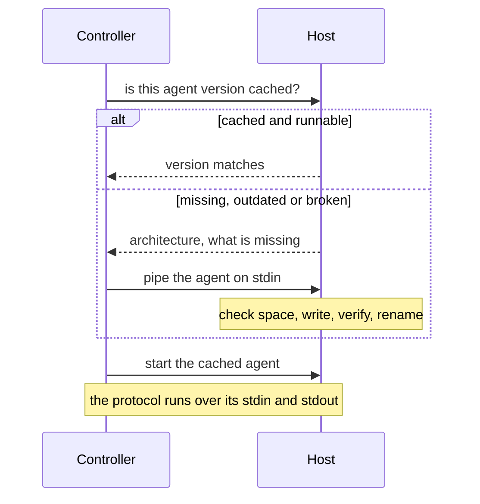

Volant reaches a managed host, puts a small static agent there, and talks to it over the same connection for the rest of the run.

## Connection types

`ansible_connection` picks the transport. It defaults to `ssh`, as in Ansible.

| Value | What it does |
|---|---|
| `ssh` | Runs the OpenSSH client from your `PATH`. Volant builds the command line itself, without a wrapper and without a Rust SSH library, so your `~/.ssh/config` applies. |
| `local` | Runs the agent as a child process on the controller, with no network. |

Any other value is not supported yet: that host is reported unreachable, with the transport named, and the rest of the run continues.

Only key files and keys held by an ssh-agent work. `ssh` runs with `BatchMode=yes` and never prompts, so a host that would ask for a password or a passphrase is reported unreachable instead of hanging the run. `-k` and `ansible_password` are not implemented, because OpenSSH cannot read a password from its standard input without `sshpass`.

## Host variables

Volant reads these per host, from the inventory or from any other variable source. A test checks this list against the names the connection code reads, so it stays in sync with the engine.

| Variable | Effect |
| --- | --- |
| `ansible_connection` | `ssh` (default) or `local` |
| `ansible_host` | Address to connect to. Defaults to the inventory name. |
| `ansible_port` | `ssh -p`. A quoted number works as well as a bare one. |
| `ansible_user` | `ssh -l` |
| `ansible_ssh_private_key_file` | `ssh -i` |
| `ansible_ssh_common_args` | Extra `ssh` arguments, split the way a shell would split them |
| `ansible_ssh_extra_args` | The same, added after the common ones |
| `ansible_remote_tmp` | Directory that holds the agent cache on that host |
| `ansible_become` | Escalate or not, overriding the `become` keyword |
| `ansible_become_user` | Target user for escalation |
| `ansible_become_method` | Must be `sudo` |
| `ansible_become_password`, `ansible_become_pass` | Escalation password |

An unbalanced quote in `ansible_ssh_common_args` or `ansible_ssh_extra_args` fails the host instead of being dropped. That matters behind a bastion: silently discarding a `ProxyCommand` would connect straight to an address that may belong to a different machine.

The `ansible.cfg` settings that affect connections, such as `timeout`, `remote_user`, `host_key_checking` and `forks`, are listed in [Configuration](/reference/configuration/).

## Reaching a host



## The agent cache

The agent is a single static executable of a few hundred kilobytes. Volant uploads it once per host and reuses it on every later run.

It lives at `<remote_tmp>/volant-agent-<version>/volant-agent`, so with the default `remote_tmp` it sits under `~/.ansible/tmp/` in a home directory. The version in the path is the controller's own, which is how an upgraded controller avoids running an older agent.

Whose home directory depends on who runs the agent. A task that does not escalate runs it as the account you log in as, and caches it there. A task that escalates runs it as the `become_user` and caches it in that user's home, written through `sudo`. This is what makes a `become_user` other than `root` work: home directories are often mode 0700, so an agent cached under your login account would be out of reach for the user you become. A host therefore holds one cache per account the run acts as, each owned by that account.

The agent travels through `ssh -C`, so OpenSSH compresses it on the wire and nothing has to be unpacked on the host.

Before every connection, Volant asks the cached agent for its version. A version mismatch, a missing file or a file that will not start all lead to a fresh upload. A broken cache, such as a copy truncated by an interrupted run, gets repaired instead of reported.

The upload checks free space with `df` first, and wants room for twice the agent plus a megabyte. It writes to a temporary name that includes the remote shell's process ID, checks the byte count, then renames into place. A transfer cut short never lands under the final name, and two runs uploading to the same host at once cannot mix their bytes.

To clear the cache, remove the directory. Nothing else is left behind:

```sh
ssh web1 'rm -rf ~/.ansible/tmp/volant-agent-*'
```

An upload already removes the cache directories of other versions, so a host holds one agent rather than a history of them.

## Persistent connections

A host keeps its connection to the agent for the whole run, across plays. Tasks travel over that one connection instead of opening a new one each time. If the connection dies between two plays, Volant reconnects once, and a second failure reports the host unreachable.

Some tasks add a connection:

- Escalation. A host that uses `become` holds a second connection, to an agent running as the target user. It is kept until the end of the play, so a play of escalated tasks starts one escalated agent, not one per task. A host holds at most one escalated connection at a time: escalating to a different user replaces it.
- Delegation. A delegated task runs over the delegate's own connection, with the delegate's settings. A host whose play delegates to three other hosts holds those three connections alongside its own.

## File descriptors

Each connection is a separate `ssh` process and costs the controller three file descriptors. With escalation, a run can hold two connections per host: the host's own and one escalated.

:::caution
With the usual `ulimit -n 1024`, the controller runs out of file descriptors at about 169 escalating hosts. `ssh` then stops starting, and the hosts it happens to hit are reported unreachable although nothing is wrong with them.
:::

Raise the limit before a run that wide:

```sh
ulimit -n 4096
volant playbook -i inventory.ini site.yml
```

An escalated connection also costs one extra `ssh` session for the `sudo` probe, two when a password is needed. There is no `ControlMaster` multiplexing yet, so every one of those sessions is paid for separately.

## Not there yet

- SSH passwords (`-k`, `ansible_password`).
- `connection` as a play, block or task keyword.
- Windows and network devices.

[Keywords](/reference/keywords/) is the full list, generated from the tables the engine reads.
