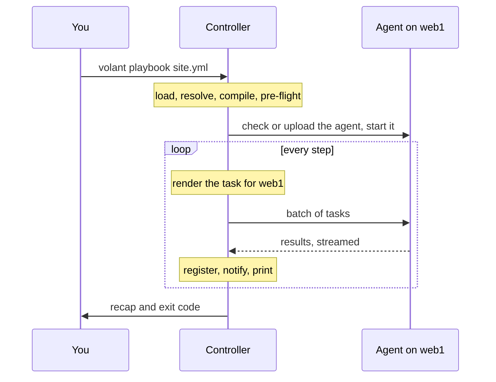

import { LinkCard } from '@astrojs/starlight/components';
import Flow from '../../../components/Flow.astro';

Volant is two programs and a protocol. The controller runs on your machine and does all the thinking. The agent runs on each host and does what it is told.

<Flow
  lanes={[
    {
      label: 'Controller',
      note: 'on your machine, before anything connects',
      steps: [
        { text: 'load files' },
        { text: 'resolve variables' },
        { text: 'compile steps' },
        { text: 'pre-flight' },
        { text: 'executor', kind: 'key' },
      ],
    },
    {
      label: 'Managed host',
      note: 'one agent, reached over a single ssh connection',
      steps: [
        { text: 'volant-agent', kind: 'key' },
        { text: 'native modules or the warm Python server' },
        { text: 'results, streamed back' },
      ],
    },
  ]}
/>

## The controller

The controller, `crates/volant`, reads `ansible.cfg`, the inventory, the playbooks and the roles. It resolves variables, renders every template, and compiles each play into a flat list of steps before it connects anywhere. The [pre-flight](/playbooks/preflight/) then stops on anything this release does not support yet.

The executor starts one driver per host, bounded by `forks`. A driver walks its host through the steps, renders each task with that host's variables, sends it to the agent and judges the result: `register`, `changed_when`, `failed_when`, handlers. A coordinator keeps the drivers in step at synchronization points and owns everything that reaches the terminal.

For Python modules, the controller asks a helper process running ansible-core to build the module payloads, and keeps the result in a cache between runs. Before the first connection it also reads the whole run to decide whether the agent may gather facts natively. See [The warm Python path](/internals/python/).

All the `ssh` runs for one inventory host share one OpenSSH connection, see [Connections and the agent](/hosts/connections/#one-connection-per-host).

## The agent

The agent, `crates/volant-agent`, is a static binary of a few hundred kilobytes, uploaded once per host and cached. It receives batches of tasks, runs them, and streams results back as they finish. It runs `command`, `shell` and `raw` itself. It also carries native versions of `setup`, `stat`, `file`, `apt`, `systemd`, `lineinfile`, `copy`, `package_facts`, `service_facts`, `user` and `group`, which answer a task when its arguments allow and hand it back otherwise. The warm Python server runs everything else, see [Native modules](/internals/python/#native-modules). It knows nothing about playbooks, variables or escalation.

## The protocol

`crates/volant-protocol` defines the frames and messages both programs share. The controller starts the agent over `ssh` and speaks the protocol over that process's standard input and output for the rest of the run. Frames are JSON, except that a blob of modules or a staged file follows its announcement as raw bytes, compressed with deflate, since protocol version 6. Changing a message means bumping `PROTOCOL_VERSION`, and the agent's version is part of its cache path, so a controller never talks to an agent from another release.

## A run, end to end

```mermaid
sequenceDiagram
  participant U as You
  participant C as Controller
  participant A as Agent on web1
  U->>C: volant playbook site.yml
  Note over C: load, resolve, compile, pre-flight
  C->>A: check or upload the agent, start it
  loop every step
    Note over C: render the task for web1
    C->>A: batch of tasks
    A-->>C: results, streamed
    Note over C: register, notify, print
  end
  C->>U: recap and exit code
```

## Design choices

Each choice that changes what users see is recorded, with its reasoning, as a decision record:

<LinkCard title="Decision records" description="Why GPL, why ansible-core 2.19, how become and batching work, why the Python path uses one archive per run, and why common modules run natively." href="/decisions/" />

<LinkCard title="Code map" description="Where each part of the engine lives in the source tree, for contributors." href="https://github.com/lorica-labs/volant/blob/main/ARCHITECTURE.md" />
