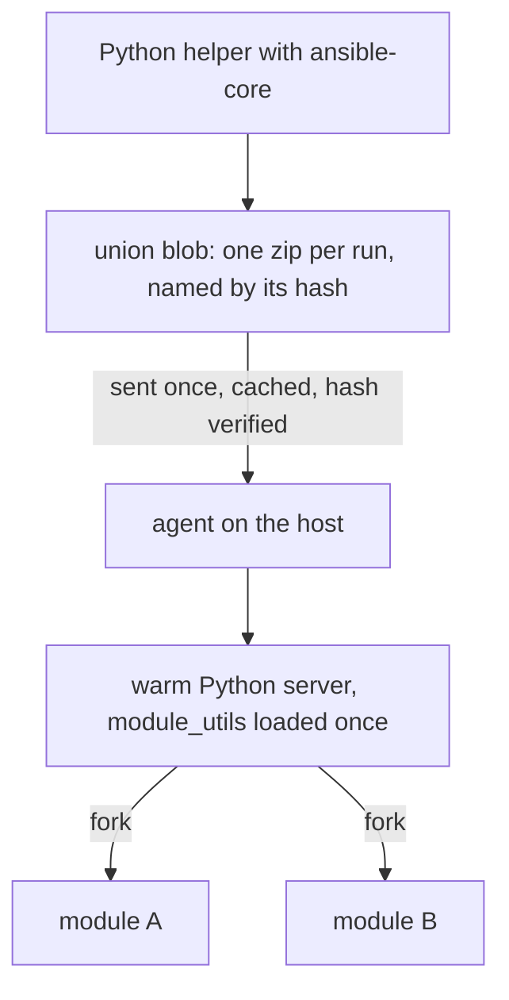

import { Aside } from '@astrojs/starlight/components';
import BarChart from '../../../components/BarChart.astro';

Most Ansible modules are Python programs. Volant runs them unchanged, but it does not start a new interpreter for each task.

## How it works

1. The controller asks a helper process to build ansible-core's payload for every module the run needs.
2. Volant merges them into one zip, the union blob, with every `module_utils` file they import. The blob is named by the BLAKE3 hash of its contents.
3. The blob is sent to each host once and cached there. The agent checks the hash before using it, and a host that already has it receives nothing.
4. The agent starts one Python server per target user. The server loads the shared code from the blob once, then forks a child for each task. The child runs the module and writes its JSON result back over a pipe.

Module results are untrusted and are never rendered as controller templates. See [Trusted and untrusted values](/variables/trust/).

## What each side needs

The controller needs Python 3 with `ansible-core`. Volant picks `VOLANT_PYTHON` first, then the active virtual environment, then `python3` on your `PATH`.

The host needs a Python 3 interpreter, but not ansible-core: the blob carries the module and every file it imports. The agent reports the interpreters it finds when it starts.

## Measured cost

These numbers come from an Ubuntu 24.04 host with Python 3.12, over SSH. Each figure is a median.

<BarChart
  title="Cost of running one module"
  subtitle="Ubuntu 24.04 host, Python 3.12, over SSH, median. Shorter is faster."
  unit="ms"
  rows={[
    { label: 'Ansible, default settings', value: 765 },
    { label: 'Ansible, pipelining', value: 469 },
    { label: 'Payload as a plain process', value: 340 },
    { label: 'Fork, nothing preloaded', value: 266 },
    { label: 'Fork, module_utils loaded', value: 12.8, highlight: true, note: 'What Volant does' },
  ]}
/>

Per module under Volant, the cost follows the work the module does. `apt` really does talk to `dpkg`: the warm path removes overhead, not work.

<BarChart
  title="Per-task cost under Volant, by module"
  subtitle="Same host and method as above."
  unit="ms"
  rows={[
    { label: 'ping', value: 12.8 },
    { label: 'lineinfile', value: 22 },
    { label: 'stat', value: 31.3 },
    { label: 'file', value: 31.6 },
    { label: 'apt', value: 755, note: 'Most of it spent in dpkg' },
  ]}
/>

Sending the modules as one archive saves 72.7 percent of the bytes, because the files they share travel once. Loading it costs 264.5 ms, once per server.

<BarChart
  title="Bytes sent for five modules"
  subtitle="ping, stat, file, lineinfile and apt."
  unit="MB"
  rows={[
    { label: 'One union blob', value: 0.631, highlight: true, note: '631,050 bytes' },
    { label: 'One zip per module', value: 2.308, note: '2,307,982 bytes' },
  ]}
/>

[Decision record 0006](/decisions/0006-warm-python-path/) has the reasoning and a measurement on a full playbook.

## Modules backed by an action plugin

Some ansible-core modules only work together with an action plugin that runs on the controller first. `package` picks the host's package manager, `service` picks its init system, and `template` renders the file on the controller before anything is sent. Sending those modules without their plugin would do something different from what the playbook asked.

Volant has its own version of five of these plugins: `copy`, `package`, `service`, `template` and `unarchive` run on the controller as a short sequence of sub-tasks, each an ordinary Python module sent over the host's existing connection. [Action plugins](/reference/action-plugins/) describes each one. The modules whose plugin Volant does not have yet, such as `fetch` and `uri`, are not supported yet: Volant names them before the first connection.

`assert`, `fail` and `pause` have action plugins too, but none of them calls a module, so Volant runs them on the controller. `setup` runs as an ordinary module, so fact gathering works.

<Aside type="note">
The [modules reference](/reference/modules/) always lists what the current release runs, since it is generated from the engine's own tables.
</Aside>
