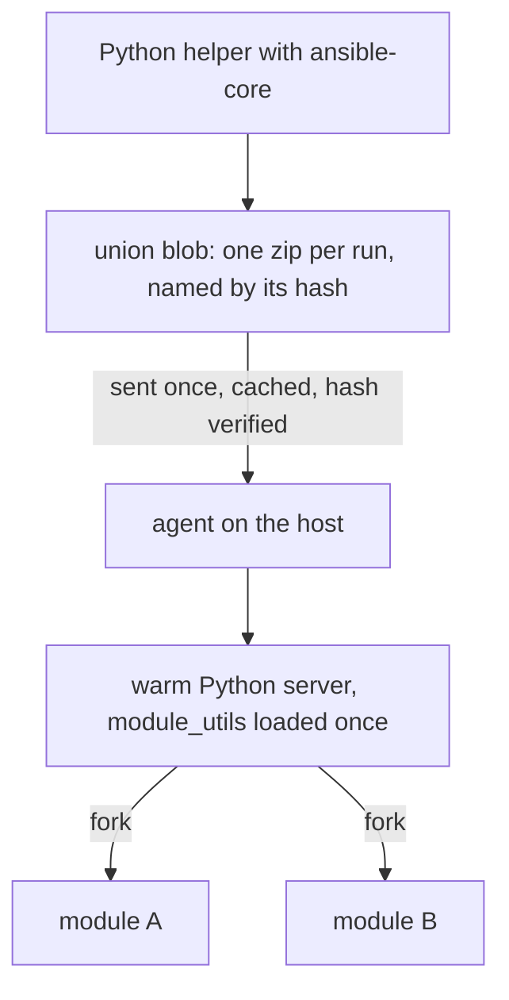

import { Aside } from '@astrojs/starlight/components';
import BarChart from '../../../components/BarChart.astro';

Most Ansible modules are Python programs. Volant runs them unchanged, but it does not start a new interpreter for each task.

## How it works



1. The controller asks a helper process to build ansible-core's payload for every module the run needs.
2. Volant merges them into one zip, the union blob, with every `module_utils` file they import. The blob is named by the BLAKE3 hash of its contents.
3. The blob is sent to each host once and cached there. The agent checks the hash before using it, and a host that already has it receives nothing.
4. The agent starts one Python server per target user. The server loads the shared code from the blob once, then forks a child for each task. The child runs the module and writes its JSON result back over a pipe.

The union is built before the first connection, so it has to hold every module a host might reach. It carries the modules the plays name, those of every task and handler file of the roles in play (their `meta/main.yml` dependencies included), and those of any file an include names literally. A module named only in a file for another platform, such as `setup-RedHat.yml` next to `setup-Debian.yml`, is in it too, so an `include_tasks: setup-{{ ansible_os_family }}.yml` finds its module whichever file a host picks. A name there that no module answers to is left out, and fails by name only if a host reaches it.

Module results are untrusted and are never rendered as controller templates. See [Trusted and untrusted values](/variables/trust/). As ansible-core does on the controller, Volant adds `stdout_lines` and `stderr_lines` to a result that has `stdout` or `stderr` without them, split with Python's `splitlines()` rules.

## What each side needs

The controller needs Python 3 with `ansible-core`. Volant picks `VOLANT_PYTHON` first, then the active virtual environment, then `python3` on your `PATH`.

The host needs a Python 3 interpreter, but not ansible-core: the blob carries the module and every file it imports. The agent reports the interpreters it finds when it starts.

## Measured cost

These numbers come from an Ubuntu 24.04 host with Python 3.12, over SSH. Each figure is a median.

<BarChart
  title="Cost of running one module"
  subtitle="Ubuntu 24.04 host, Python 3.12, over SSH, median. Shorter is faster."
  unit="ms"
  rows={[
    { label: 'Ansible, default settings', value: 765 },
    { label: 'Ansible, pipelining', value: 469 },
    { label: 'Payload as a plain process', value: 340 },
    { label: 'Fork, nothing preloaded', value: 266 },
    { label: 'Fork, module_utils loaded', value: 12.8, highlight: true, note: 'What Volant does' },
  ]}
/>

Per module under Volant, the cost follows the work the module does. `apt` really does talk to `dpkg`: the warm path removes overhead, not work.

<BarChart
  title="Per-task cost under Volant, by module"
  subtitle="Same host and method as above."
  unit="ms"
  rows={[
    { label: 'ping', value: 12.8 },
    { label: 'lineinfile', value: 22 },
    { label: 'stat', value: 31.3 },
    { label: 'file', value: 31.6 },
    { label: 'apt', value: 755, note: 'Most of it spent in dpkg' },
  ]}
/>

Sending the modules as one archive saves 72.7 percent of the bytes, because the files they share travel once. Loading it costs 264.5 ms, once per server.

<BarChart
  title="Bytes sent for five modules"
  subtitle="ping, stat, file, lineinfile and apt."
  unit="MB"
  rows={[
    { label: 'One union blob', value: 0.631, highlight: true, note: '631,050 bytes' },
    { label: 'One zip per module', value: 2.308, note: '2,307,982 bytes' },
  ]}
/>

[Decision record 0006](/decisions/0006-warm-python-path/) has the reasoning and a measurement on a full playbook.

## Modules from collections

A module from an installed collection, such as `ansible.posix.sysctl` or `community.general.ufw`, runs on the warm Python path like a builtin one. Volant never installs a collection. Before the first connection it asks the controller's ansible-core what each dotted name is, and ansible-core looks only in the collection paths it is configured with, such as `ANSIBLE_COLLECTIONS_PATH`. Nothing is fetched to answer.

A name outside `ansible.builtin` and `ansible.legacy` gets one of four answers:

| What ansible-core finds | What Volant does |
|---|---|
| a module it can build | adds it to the union and runs it |
| a module its collection runs through an action plugin, directly or through `runtime.yml` routing | stops the run: Volant does not run a collection's action plugins |
| no module by that name | stops the run with the reference's sentence |
| a module it cannot run: removed, PowerShell only, or failing to build | stops the run, with the reason |

The refusals come before the first connection, with exit code 4:

```text
task 'Forward': couldn't resolve module/action 'ns.coll.mod'. This often indicates a misspelling, missing collection, or incorrect module path. The collection 'ns.coll' is not installed on the controller: install it with ansible-galaxy collection install ns.coll
task 'Forward': module 'ns.coll.mod' needs an action plugin from its collection, which this release does not run
task 'Forward': module 'ns.coll.mod' cannot run: <reason>
```

The install hint appears only when the collection itself is missing. A module missing from a collection that is installed gets the first sentence alone. `ansible.builtin.nosuch` also gets it alone, because no collection can supply a name in the namespace ansible-core owns. Without an ansible-core on the controller, a name outside `ansible.builtin` is refused with the same first sentence and the reason nothing could look it up.

In the union, a builtin keeps its short name and a collection module is keyed by its full name. Two collections that each ship a module called `sysctl` stay apart, and `community.general.command` is never mistaken for `command`.

A collection module named only in a role's file for another platform is resolved too. If it can be built, it joins the union. Anything else is left out without stopping the run, and the include that reaches it fails for that host before any of the file's tasks run:

```text
task 'Forward': module 'ansible.posix.sysctl' was not resolved to a module before the run, so no payload holds it: its collection is not installed on the controller, runs it through an action plugin, or it is named only in a file nothing read before the first connection
```

A collection module's arguments written as a string (`ansible.posix.sysctl: name=net.ipv4.ip_forward value=1`) are split into `key=value` pairs the way ansible-core's `parse_kv` splits them.

## Modules backed by an action plugin

Some ansible-core modules only work together with an action plugin that runs on the controller first. `package` picks the host's package manager, `service` picks its init system, and `template` renders the file on the controller before anything is sent. Sending those modules without their plugin would do something different from what the playbook asked.

Volant has its own version of eight of these plugins: `copy`, `dnf`, `fetch`, `package`, `reboot`, `service`, `template` and `unarchive` run on the controller as a short sequence of sub-tasks, each an ordinary Python module or a bare command sent over the host's existing connection. [Action plugins](/reference/action-plugins/) describes each one. The modules whose plugin Volant does not have yet, such as `uri` and `script`, are not supported yet: Volant names them before the first connection.

`assert`, `fail` and `pause` have action plugins too, but none of them calls a module, so Volant runs them on the controller. `setup` runs as an ordinary module, so fact gathering works.

<Aside type="note">
The [modules reference](/reference/modules/) always lists what the current release runs, since it is generated from the engine's own tables.
</Aside>
