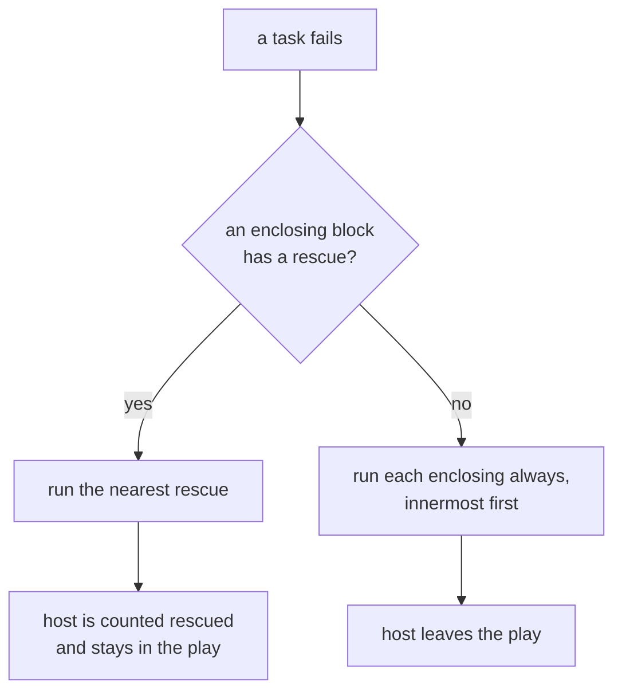

A block groups tasks so that `rescue` can catch their failure and `always` can run whatever happened. Keywords on the block apply to every task inside it.

```yaml
- block:
    - name: Deploy the new release
      command: /opt/app/deploy.sh
  rescue:
    - name: Roll back
      command: /opt/app/rollback.sh
    - debug:
        msg: "{{ ansible_failed_task.name }} failed: {{ ansible_failed_result.msg | default('') }}"
  always:
    - name: Clear the maintenance flag
      command: rm -f /srv/app/MAINTENANCE
```

## When a task fails



The host looks outward for the nearest enclosing block with a non-empty `rescue` and enters it. Inside that rescue, two facts are set on the host: `ansible_failed_task`, the task as it was written, and `ansible_failed_result`, the result that failed. Both stay readable after the block and in later plays.

A host that recovers this way is counted as `rescued` in the recap and stays in the play. Only a failure that nobody rescued removes a host from the set of live hosts.

A failure inside a `rescue` is not caught by the same block. It goes to the next rescue further out.

## always

`always` runs whether the body succeeded, failed or was rescued. On the way out of an unrescued failure it runs too, innermost block first.

A failure inside an `always` ends that section: the rest of it is skipped, and the host keeps going outward, running the `always` of every block that still encloses it.

## What is never rescued

- A host that never entered a rescue skips every step inside it, including a flush point and the handlers behind it.
- A host that cannot be reached leaves the play. There is nothing left to run a rescue on.
- When a `run_once` task fails, the hosts that were waiting on it leave the play, even if a rescue keeps the host that ran it.

## Differences from Ansible

- In `ansible_failed_task`, a keyword this release does not execute reads as `null` rather than as the reference's default. A default such as `connection: "ssh"` would describe something Volant does not honor.
- `ansible_failed_task` has one key per keyword and leaves out the six the reference keeps for itself (`uuid`, `finalized`, `squashed`, `_resolved_action`, `async_val`, `loop_with`). Its `args` holds what the playbook wrote, without the nineteen `_ansible_*` keys the reference adds.
- A host whose `ansible_connection` names a transport this release does not have is reported unreachable, so a rescue does not catch it. Ansible treats that as an ordinary task failure and rescues it.
