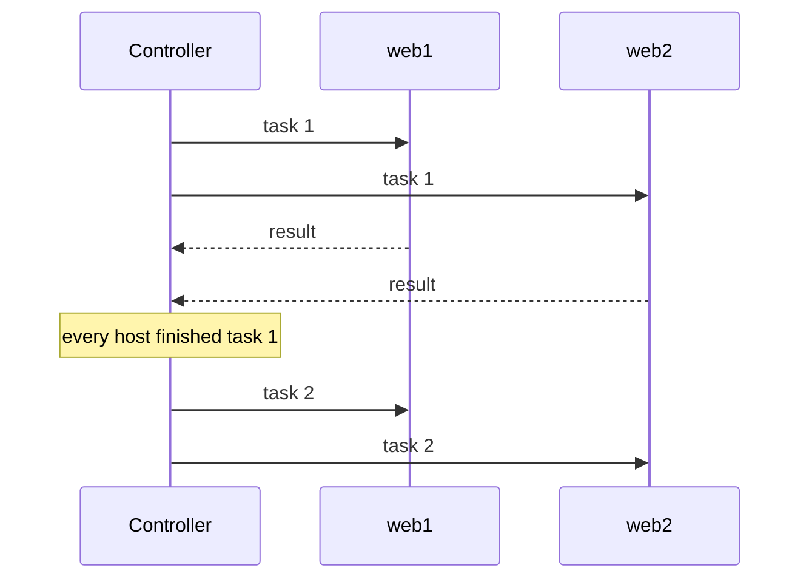

import { Aside } from '@astrojs/starlight/components';
import Flow from '../../../components/Flow.astro';

The pages in this section explain what each keyword does once Volant runs it. [Keywords](/reference/keywords/) says which keywords this release accepts. Each page ends with the places where Volant deliberately behaves differently from ansible-core 2.19.12, and why.

## From a tree to a list

You write a play as a tree: sections, roles, blocks, tasks. Volant flattens it once, before it connects to anything, into a single numbered list of steps. Every host then walks that same list, in the order ansible-core runs it:

<Flow
  lanes={[
    {
      steps: [
        { text: 'pre_tasks' },
        { text: 'flush', kind: 'point' },
        { text: 'roles, each after its dependencies' },
        { text: 'tasks' },
        { text: 'flush', kind: 'point' },
        { text: 'post_tasks' },
        { text: 'flush', kind: 'point' },
      ],
    },
  ]}
/>

The three handler flush points are always there. Whether a play has handlers at all is only known once its roles are read from disk, so the compiler lays out all three. A flush with nothing to run prints nothing.

Keywords written on a play, a role entry or a block are folded into each task underneath while the play compiles, and the innermost value wins. A `become: true` on the play and a `become: false` on one task give exactly what Ansible gives, and the run does not have to carry the tree around.

Blocks survive the flattening as spans over the list. A small jump table over those spans tells a host where to go after a step succeeds, fails, or is skipped. [Blocks](/playbooks/blocks/) covers what that means for `rescue` and `always`.

## Hosts move together

By default Volant follows Ansible's `linear` strategy: the hosts of a play meet in front of every task. No host starts task two until every host has finished task one, and the output arrives in task order because the run happens in task order.

[Cross-host batching](/hosts/batching/) is an opt-in setting that lets each host run ahead through tasks that do not depend on the others.

## Where the work happens

Templating happens on the controller. Each host renders its own copy of a task with its own variables, and the rendered task goes to that host's agent over a connection that stays open for the whole run. The agent runs it and streams the result back. The controller then applies `register`, `changed_when`, `failed_when` and `notify`, and prints the result line.

Some modules never leave the controller: `debug`, `set_fact`, `assert`, `fail`, `pause`, `include_vars` and `validate_argument_spec`. See [Modules](/reference/modules/).

<Aside type="tip">
The [architecture page](/internals/architecture/) follows the same run from the point of view of the source code.
</Aside>
