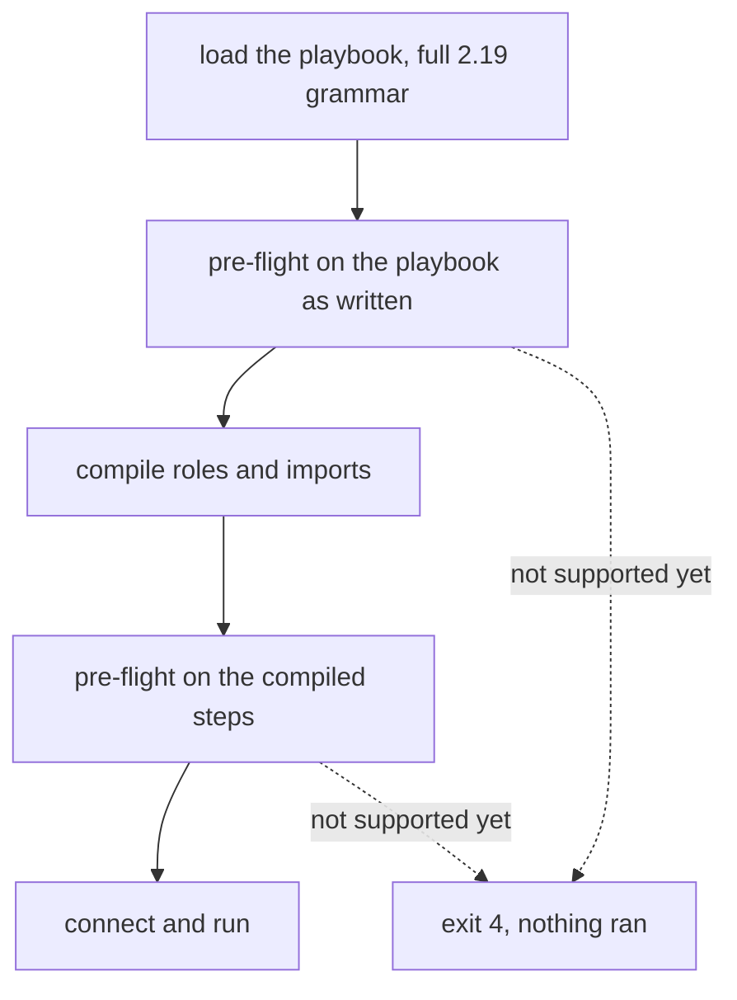

Volant's loader accepts the whole ansible-core 2.19 grammar, so a playbook parses here as it parses under Ansible. A second check, the pre-flight, then looks for everything the loader accepted and this release does not support yet. If it finds any, it names each one and stops the run before the first connection, before any banner and before any recap.

Without it, a keyword that slipped past both checks would be ignored in silence, and the run would report success after skipping what you asked for.

The check runs twice: once on the playbook as written, and once on the compiled steps. The second pass is the only place where a keyword written inside a role or an imported file is visible. Every section of a block is checked, `rescue` and `always` included.

What a dynamic include brings in is checked when a host reaches it. See [Includes and imports](/playbooks/includes/#dynamic-includes).

## Exit codes

A run the pre-flight stops exits with code 4, which is what Ansible uses for a playbook it cannot load. Some cases keep the code Ansible was measured to use:

| Case | Exit code |
|---|---|
| Anything this release does not support yet | 4 |
| A role nobody can find | 1 |
| An unknown `meta` action or `notify` name | 1 |
| An escalation method this release does not support yet | 2 |

[Exit codes](/reference/exit-codes/) lists every code Volant uses.

## check_mode

`check_mode: false` is accepted and changes nothing, since running the task for real is what this release does anyway. `check_mode: true` is not supported yet, because there is no check mode. Running a task for real when the playbook asked to be told what it would do is worse than stopping.

Listings and `--syntax-check` never call the pre-flight, so you can read a playbook before the release that runs it ships.

## Differences from Ansible

- The first pass reads the play as written, so a task that `--tags` would have dropped still stops the run when it uses something not supported yet. The second pass reads the compiled steps, after tag selection. This errs toward stopping more often, never less.
- `tags` and `timeout` are checked before their value is looked at, so `tags: 3` does not get Ansible's type error.
- A `with_` key that names a real lookup plugin is reported by that name as not supported yet. Ansible runs all twenty-five; only `with_items` has a loop here.
- For a module this release does not support yet, the arguments are not parsed, so the error is about the module and not about a `key=value` on the next line.
- An invalid `meta` action is rejected before the first connection rather than after the play banner, with the reference's message and exit code 1.
- `gather_facts`, `ignore_errors` and `become` written as something other than true or false are rejected when the playbook loads, one step earlier than Ansible rejects them, with the reference's message and exit code. A templated `ignore_errors: "{{ ... }}"` is not: it is rendered when the task runs, for each loop item, and read with the reference's boolean rules.
- The `meta` actions `refresh_inventory`, `clear_facts`, `clear_host_errors`, `reset_connection`, `end_host` and `end_play` are not supported yet. Accepting a `meta` action that does nothing is exactly the kind of bug the pre-flight exists to prevent.
